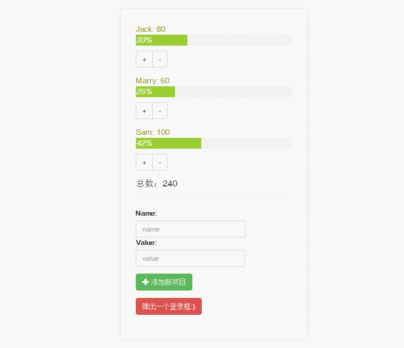

# 介绍

一个包含了多个 Vue 单文件组件的页面实例，主要熟悉一下 vue-cli 的工作方式。

# 如何使用

修改 `index.html` 可以自定义模板

加入了 Less 支持

写好的组件 `*.vue` 文件放在 `/src/components` 里，通过 `src/App.vue` 来定义插入

### 安装依赖
`npm install`

### 打开本机环境 `localhost:8080`
`npm run dev`

### 输出生产用文件
`npm run build`